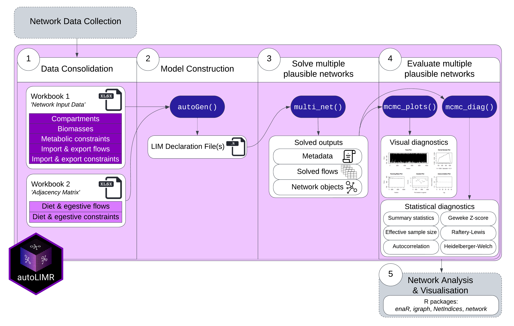

<style>
body {
text-align: justify}
</style>

```{r setup, include = FALSE}
library(bookdown)
```

```{r, include=FALSE}
devtools::load_all(".")
```

```{r, include = FALSE}
knitr::opts_chunk$set(
  collapse = TRUE,
  comment = "#>"
)
```

# Introduction 

Data variability is an inherent part of ecosystem models. To include data uncertainty in model outputs, a popular method is to solve multiple plausible representations of the model. The multiple plausible representations each represent a plausible configuration of flow values given the ecological input constraints. Together, the ensemble of plausible model representations capture the inherent ecological variability, enabling increased realism of model outputs and interpretations.

Multiple plausible ecological networks are frequently solved using linear inverse modelling with Markov Chain Monte Carlo (LIM-MCMC) with R packages [LIM](https://CRAN.R-project.org/package=LIM) (van Oevelen et al., 2010), and embedded R package [limSolve](https://CRAN.R-project.org/package=limSolve) (Soetaert et al., 2009). 
To use these packages, all input data on network structure (compartments and directed flows) and flow constraints (lower and upper bounds) need to be manually coded into linear equations and declared in particular sections in a LIM-readable text file, the so-called LIM declaration file (van Oevelen et al., 2010). This becomes less manageable in terms of complexity and time as network size increases.

Further, the evaluation of how well the multiple plausible food webs represent the ecological input data (model quality) needs to be assessed. In ecological modelling, model quality is often assessed with trace plots (Van den Meersche et al., 2009; van der Heijden et al., 2020) and interpretations of convergence of each flow mean and standard deviation values to a stable value (Bell et al., 2017; de Jonge et al., 2020) or not reported at all. While these diagnostics provide some indication of LIM-MCMC algorithm performance, they neglect critical measures of algorithm performance, such as precise measures of mixing or autocorrelation (the degree to which samples are correlated), limiting the confidence that the model outputs are fully representative of the ecological input data. 

To overcome the hurdles of input file construction, and evaluation of multiple plausible networks in ecological modelling, we developed R package __autoLIMR__: an inclusive and automated workflow to (1) create input files, (2) generate multiple plausible food web flow values, (3) pack solved flow values into network objects for network analysis and visualisation, and (4) evaluate solved flow values (‘model quality’) with established MCMC convergence diagnostics. We describe the latest package version and apply it to an empirically inspired four-compartment food web time series of four seasonal time steps (‘Summer’, ‘Autumn’, ‘Winter’, ‘Spring’). 

While our example focuses on ecological networks, __autoLIMR__ applications is flexible and easily adaptable to a variety of system science disciplines. By removing barriers in the network construction and evaluation process, __autoLIMR__ can improve the uptake of LIM techniques in network modelling, and the quality of constructed networks. 

# Software Requirements & Getting Started

The latest version of __autoLIMR__ can be installed from [GitHub](https://github.com/gemmagerber/autoLIMR). __autoLIMR__ dependencies are automatically installed, including cellranger (>= 1.1.0) (Bryan, 2016), readxl (>= 1.4.1) (Wickham and Bryan, 2022), and utils (>= 4.2.1) (R Core Team, 2022). 

```{r, eval = FALSE}
devtools::install_github("gemmageber/autoLIMR")
library(autoLIMR)
```

# __autoLIMR__ workflow overview

An ecosystem network consists of the biomass of each functional group or species, their energy or nutrient requirements and outputs, and their trophic interactions. These data are collected before using __autoLIMR__ (e.g., see Fath et al., 2007; Scharler & Borrett, 2021 for instructions on network construction). The first step to using __autoLIMR__ is to consolidate the data into two Excel workbooks (`.xlsx`) or two CSV documents (`.csv`) containing network input data on compartments, biomasses, and metabolic constraints (Workbook 1), and the proportional diet and egestive flows between compartments (‘who eats who and by how much’, Workbook 2) (Figure \@ref(fig:workflow)). After that, the __autoLIMR__ workflow consists of three core R functions. 

The first function, `autoGen()`, translates network data into LIM declaration files compatible with R packages
[LIM](https://CRAN.R-project.org/package=LIM) and
[limSolve](https://CRAN.R-project.org/package=limSolve).
Function `autoGen()` imports network data from the two workbooks, translates the data into linear equations describing network topography and parameters, arranges them in multiple ‘LIM Declaration files’ (‘.R’ file extension) each representing one network model, and writes these files to the computer hard drive. 

The second core function, `multi_net()`, solves multiple plausible networks for each network model described by a LIM declaration file. Function `multi_net()` uses LIM-MCMC methods from R packages 
[LIM](https://CRAN.R-project.org/package=LIM) and
[limSolve](https://CRAN.R-project.org/package=limSolve)
to simulate a user-defined number of plausible solutions valid within the ecologically derived input data constraints. With the `multi_net()` function, users can toggle the LIM-MCMC algorithm parameters (starting point, jump size, iterations). The result of the `multi_net()` function is an R list of combined model output items, including 1) metadata, 2) a table of solved food web flow values, and 3) solved values packed into network objects. 

The third and final core function, `mcmc_diags()`, evaluates the quality of the multiple plausible networks, i.e., how well the networks represent the input data constraints, using several Markov Chain Monte Carlo (MCMC) convergence diagnostics. To statistically assess MCMC convergence of every flow of the multiple plausible networks, function `mcmc_diags()` applies six different MCMC convergence diagnostics and returns the output in a list. The convergence diagnostic outputs, when assessed together, provide a holistic assessment of three main criteria of convergence (stationarity, mixing, and sampling efficiency). An additional function, `mcmc_plots()`, plots five visual diagnostics for a single flow simultaneously. This is useful to assess convergence of a few flows of research interest, rather than all flows at once. 

```{r workflow, echo = FALSE, out.width = "100%", fig.align = 'center', fig.cap = "_Main workflow of R package __autoLIMR__. First, network data is consolidated into two main workbooks. Next, function `autoGen()` constructs LIM declaration files for each network described in the input workbooks. Function `multi_net()` solves multiple plausible networks for each network defined by a LIM declaration file. Model quality of the multiple plausible networks is then assessed with visual (`mcmc_plots()`) and statistical (`mcmc_diag()`) Markov Chain Monte Carlo (MCMC) convergence diagnostics. Once the multiple plausible networks have been deemed ‘good’ quality, network visualisation and analysis can be applied to the multiple plausible networks using existing R packages_"}

```

# User Guide

We describe how to use __autoLIMR__ using a theoretical four-compartment network, describing the network interactions and flow constraints over seasonal time-steps of Winter, Spring, Summer, and Autumn (Figure \@ref(fig:network)).

```{r network, eval = TRUE, echo = FALSE, out.width = "100%", fig.align = 'justified', fig.cap = "_Conceptual four-compartment network with flows describing exchanges between compartments within and across a defined system boundary_"}
knitr::include_graphics("images/network.png")
```

## Network construction with __autoLIMR__

Prior to using __autoLIMR__, all network data are calculated to a specific model currency or defined as simple proportions of another variable (Fath et al., 2007; Scharler and Borrett, 2021). In our example, the model currency is in units of carbon, i.e., mg C·m^--2^ for compartment biomasses, and mg C·m^--2^·day^--1^ for flows. This informtion will be used to create LIM declaration files, which are the necessary input files for solving mulriple plausible networks with 
[LIM](https://CRAN.R-project.org/package=LIM) (van Oevelen et al., 2010), and embedded R package [limSolve](https://CRAN.R-project.org/package=limSolve) (Soetaert et al., 2009). 


__autoLIMR__ requires the user to differentiate and store the required network data in two separate Excel documents: 1) contains all 'Network Input Data', and 2) contains all internal compartment interactions in 'Adjacency Matrix'. In each document, each sheet corresponds to one network, and each sheet should be named uniquely, and matched identically between the two documents. Both documents should be saved in the active R session working directory. We go through each document in detail below.

### Network Input Data Workbook

The first workbook contains network information on: 1) internal compartment names, 2) their respective biomasses, and 3) compartment-specific metabolic constraints. Each sheet will contain all the network information relating to that specific network (Figure \@ref(fig:input)).

__autoLIMR__ requires the final list of internal compartments to be listed under column 'Compartment', and respective biomasses under the column 'Biomass'. The network information is listed under separate column headings, with each row hosting the information for a particular compartment. The network information describes lower and upper bounds for inputs and outputs of each living compartment if these values are available. If only equalities exist for the particular parameter, the should be entered as both lower and upper values. __autoLIMR__ understands compartment inputs and outputs as Consumption (Q) (or the equivalent gross primary production (GPP) in the case of primary producers), Production (P) (or the equivalent Net Primary Production (NPP) in the case of primary producers), unused material/energy (egestion and mortality combined) (U), and assimilation efficiency (AE) (as a fraction of total consumption). The values can be absolute values, or simple proportions of another variable e.g., `Plant_R = 0.02 * Plant_NPP`. If the metabolic parameter values are not available, the user leaves these blank, and no constraints for Q, P, U, or AE (or primary producer equivalents) are generated by __autoLIMR__.

For all compartments that feature imports (_IM_) and exports (_EX_) across the system boundary the user inputs lower and upper inequalities in separate columns. If a compartment receives an import or export, but the inequalities are not known, the user inputs a `1` in the respective column.

```{r input, eval = TRUE, echo = FALSE, out.width = "100%", fig.align = 'justified', fig.cap = "_Network input data sheet Winter example, showing pre-calculated data describing the food web model compartments, biomasses, and metabolic constraints entered a named Excel spreadsheet. Column headings describe the metabolic data in the column, and each row corresponding to one compartment. Each named spreadsheet corresponds to a seperate network ('Winter', 'Spring', 'Summer', 'Autumn'), each containing all relevant network-specific information. __autoLIMR__ accepts both character and numeric input from the spreadsheet._"}
knitr::include_graphics("images/netinputwinter.png")
```

To view the network input data for all seasons, the example network data provided with __autoLIMR__ can be fetched with `demo_net_input()`. The demo network data input is a list of four data tables containing network data input for 'Winter', 'Spring', 'Summer', and 'Autumn' four-compartment networks.

### Adjacency Matrix Data Workbook

In the 'Adjacency Matrix Input' workbook, flows between source (row _i_) and recipient (column _j_) are defined by `1` (Figure \@ref(fig:admat)). If the proportions of compartmental inflow from different sources are provided, these can instead be entered as a constraint in the form of _lower value, upper value_. For example, `0.2,0.5` indicates that a specific flow comprises 20 - 50 % of compartment _j_'s total consumptive input. If only the lower proportion is known, it can be entered as _lower value, 1_, e.g., `0.2, 1` indicates that the flow contributes a minimum of 20 % and a maximum of 100% to total consumption. If only the upper diet proportion is known, it can be entered as the constraint _upper value_ or _0, upper value_ (e.g., `0.6` or `0, 0.6` – indicating that the flow contributes a maximum of 60 % to total consumption). R packages LIM and limSolve do not use flow values below or equal to zero (van Oevelen et al., 2010).

```{r admat, echo = FALSE, out.width = "100%", fig.align = 'center', fig.cap = "_Adjacency matrix data Winter example, describing flows and flow constraints from compartment in row _i_ to compartment in column _j_. Each named spreadsheet corresponds to a seperate network ('Winter', 'Spring', 'Summer', 'Autumn'), each containing all relevant network-specific information. __autoLIMR__ accepts both character and numeric input from the spreadsheet._"}
knitr::include_graphics("images/adjmatwinter.PNG")
```

To view the adjacency matrix data for all seasons, the example adjacency matrix data provided with __autoLIMR__ can fetched with `demo_adj_mat()`. The demo adjacency matrix input is a list of four data tables containing adjacency matrices for 'Winter', 'Spring', 'Summer', and 'Autumn' four-compartment networks. Each adjacency matrix describes internal flows of energy/material from compartment in row _i_ to compartment in column _j_.

### `autoGen()`: write LIM declaration files into folders in working directory

Once both workbooks have been populated, `autoGen()` uses data from both workbooks and translates the data into ready-to-use LIM declaration file formatted objects. Users can choose to manually write these to the computer hard drive, or can specify `force = TRUE` within the argument to give permissionto automatically write to the hard drive.

The translation depends on three main `autoGen()` arguments: 1) whether respiration from living compartments to an external CO2 sink is included in the network (LOGICAL, default `respiration = TRUE`), 2) whether each compartment is living or non-living (character string or vector of inputs, default `NLNode = NULL`), and 3) whether each compartment sources its energy from outside the system boundary e.g., primary producers in ecological networks (character string or vector of inputs, default `primary_producer = NULL`).

A handy demo of `autoGen()` is included in this package, using the demo data sets from `demo_net_input()` and `demo_adj_mat()`. Users can simply run the code below, with the `net_data_input = "demo"` and `adj_mat_input = "demo"` to automatically pull the respective demo data sets into `autoGen()` and write the respective folders of LIM declaration files to the working directory. 

```{r, eval = FALSE}
autoGen(
  net_data_input = "demo",
  adj_mat_input = "demo",
  NLNode = "Detritus",
  primary_producer = "Plant",
  respiration = TRUE,
  author = "autoLIMR authors",
  force = TRUE
)
```

In cases of multiple non-living compartments (Figure \@ref(fig:net2)), for example, differentiation between suspended and sedimented particulate organic carbon (susPOC and sedPOC), these can rather be entered as a vector of inputs e.g., c(‘susPOC’, ‘sedPOC’). autoGen() attaches an ‘NLNode’ text string to each of the defined inputs, such that ‘susPOC’ becomes ‘susPOCNLNode’, and ‘sedPOC’ becomes ‘sedPOCNLNode’. Multiple primary-producing compartments can be specified in the same way.

```{r net2, echo = FALSE, out.width = "100%", fig.align = 'center', fig.cap = "_A network consisting of multiple non-living and primary producer compartments can easily be defined as vectors of inputs within the `autoGen()` function. In this example, the `NLNode` argument would be defined as `NLNode = c('Detritus_1', 'Detritus_2')`, and the 'primary_producer' argument as `primary_producer = c('Plant_1', 'Plant_2')._"}
knitr::include_graphics("images/network2.png")
```

An example of the Winter weighted LIM declaration output from __autoLIMR__:

```{r, eval = FALSE}
! Weighted Network
! Network LIM Declaration File
! Composed with autoLIMR
! Author: gemma
! Date: 2023-06-17

! Respiration included: Yes
! U included: Yes

! Living compartments: 3
! Non-living compartments: 1
! External compartments: 7
! Boundary flows: 10
! Internal flows: 6

! Abbreviations
! GPP = Gross Primary Production (Primary Producers only)
! Q = Consumption
! NPP = Net Primary Production (Primary Producers only)
! P = Production
! R = respiration
! U = Passive flows to non-living compartments/Unassimilated material
! AE = Assimilation Efficiency
! IM = Import flow
! EX = Export Flow
! NLNode = Non-living compartment

### COMPARTMENTS

Invert = 822
Plant = 500
Vert = 222
DetNLNode = 7111

### END COMPARTMENTS

### EXTERNALS

CO2
DetNLNodeImport
PlantImport
DetNLNodeExport
InvertExport
PlantExport
VertExport

### END EXTERNALS

### VARIABLES

! Consumption (Q) / Gross Primary Production (GPP) Variables

Invert_Q = Flowto(Invert)
Plant_GPP = Flowto(Plant) - Plant_IM
Vert_Q = Flowto(Vert)

! Production (P/NPP) Variables

Invert_P = Flowfrom(Invert) - Invert_R - Invert_U - Invert_EX
Plant_NPP = Flowfrom(Plant) - Plant_R - Plant_U - Plant_EX
Vert_P = Flowfrom(Vert) - Vert_R - Vert_U - Vert_EX

! Unused Energy/Material (U) Variables

Invert_U = Flowto(Invert) - Invert_P - Invert_R - Invert_EX
Plant_U = Flowto(Plant) - Plant_NPP - Plant_R - Plant_EX
Vert_U = Flowto(Vert) - Vert_P - Vert_R - Vert_EX


### END VARIABLES

### FLOWS

! GPP flows

Plant_GPP: CO2 -> Plant

! Respiration flows

Plant_R: Plant -> CO2
Invert_R: Invert -> CO2
Vert_R: Vert -> CO2

! Import flows

DetNLNode_IM: DetNLNodeImport -> DetNLNode
Plant_IM: PlantImport -> Plant

! Export flows

DetNLNode_EX: DetNLNode -> DetNLNodeExport
Plant_EX: Plant -> PlantExport
Invert_EX: Invert -> InvertExport
Vert_EX: Vert -> VertExport

! Adjacency Matrix flows

DetNLNode_Q_Invert: DetNLNode -> Invert
Invert_Q_Vert: Invert -> Vert
Invert_U_DetNLNode: Invert -> DetNLNode
Plant_Q_Invert: Plant -> Invert
Plant_U_DetNLNode: Plant -> DetNLNode
Vert_U_DetNLNode: Vert -> DetNLNode

### END FLOWS

### INEQUALITIES

! Network Data Input Inequalities

Plant_GPP > 700
Plant_GPP < 1000
DetNLNode_IM < 0.1*DetNLNode
Plant_IM < 0.1*Plant
DetNLNode_EX < 0.1*DetNLNode
Plant_EX < 0.1*Plant
Invert_EX < 0.1*Invert
Vert_EX < 0.1*Vert

! Adjacency Matrix Inequalities

DetNLNode_Q_Invert = Invert_Q * [0.01,0.6]
Plant_Q_Invert < Invert_Q * 0.6
Invert_Q_Vert = Vert_Q * [0.6,1]

### END INEQUALITIES

```

## Calculating multiple plausible networks

Function `multi_net()` uses LIM-MCMC methods from R packages 
[LIM](https://CRAN.R-project.org/package=LIM) (van Oevelen et al., 2010), and  [limSolve](https://CRAN.R-project.org/package=limSolve) (Soetaert et al., 2009) 
to simulate a user-defined number of plausible solutions valid within the ecologically derived input data constraints. 

With the `multi_net()` function, users can toggle the LIM-MCMC algorithm parameters (starting point, jump size, iterations). The result of the `multi_net()` function is an R list of combined model output items, including 1) metadata, 2) a table of solved food web flow values, and 3) solved values packed into network objects.

```{r, eval = FALSE}
set.seed(1) 						# Initialise pseudorandom number generator
winter_nets <- multi_net(
  file =  ‘Winter_Weighted_Network_LIMfile.R’, # The LIM declaration file
  x0 = NULL,                                   # The algorithm starting solution
  iter = 5000,                                 # Define the number of iterations
  jmp = 20,                                    # Define the jump size
  pack = TRUE                                  # Pack into network objects
)

```

## Evaluate model quality

__autoLIMR__ evaluates model quality using Markov Chain Monte Carlo (MCMC) convergence diagnostics. Together, the diagnostics report three core aspects of MCMC convergence: 1) stationarity - whether the flow has successfully targeted the underlying solution space (posterior) distribution; 2) mixing - whether the samples are effectively integrating over the posterior probability; and 3) sampling intensity - whether enough samples (iterations) have been returned to describe the posterior distribution adequately.

### Visual MCMC diagnostics

__autoLIMR__ consist of five different MCMC convergence diagnostic plots for each variable (flow) of the multiple plausible food web networks, namely:

* Trace plot with `trace_plot()`
* Kernel density plot with `dens_plot()`
* Running mean plot with `runmean_plot()`
* Geweke Plot with `geweke_plot()`
* Autocorrelation plot with `autocorr_plot()`

Each plot assesses a different aspect of MCMC convergence and can be assessed together to provide an enhanced evaluation. While each __autoLIMR__ visual diagnostic plot function can be used independently, a convenient summary plot function, `mcmc_plots()`, visualises all diagnostics simultaneously

```{r, fig.width = 7, fig.height = 5}
# Fetch LIM declaration file path
fpath <- system.file("example_limfiles",
              "Winter_Weighted_Network_LIMfile.R",
              package = "autoLIMR") 

# Solve multiple plausible networks
# Generates an object of class 'multi_net_object'
set.seed(1)
winter_networks <- multi_net(
  file = fpath,
  iter = 5000,
  jmp = 20,
  x0 = NULL
)

# Plot visual MCMC convergence diagnostics for flow 'Plant_GPP'
# With figure titles
mcmc_plots(x = winter_networks, flow = "Plant_GPP", addtitle = TRUE)
# Plot visual MCMC convergence diagnostics for flow 'Plant_EX'
# Without figure titles
mcmc_plots(x = winter_networks, flow = "Plant_EX", addtitle = FALSE)
```


### Statistical MCMC diagnostics

In addition to visual diagnostics, __autoLIMR__ provides several statistical MCMC convergence diagnostics to define convergence more precisely than visual diagnostics. A convenience function, `mcmc_diags()`, returns the diagnostic output of six MCMC convergence diagnostics as a list of data tables. The `mcmc_diags()` function can be applied to assess statistical convergence for all flows of the multiple plausible networks or to assess one flow at a time.


```{r}
# Fetch LIM declaration file path
fpath <- system.file("example_limfiles",
              "Winter_Weighted_Network_LIMfile.R",
              package = "autoLIMR") 

# Solve multiple plausible networks
# Generates an object of class 'multi_net_object'
set.seed(1)
winter_networks <- multi_net(
  file = fpath,
  iter = 5000,
  jmp = 20,
  x0 = NULL
)

# Statistical MCMC convergence diagnostics
# All variables (flows) at once
diags <- mcmc_diags(
       x = winter_networks			# 'multi_net()' object of class ‘multi_net_object’
)

diags_table <- do.call(		      # Convert list to data frame
       cbind, diags
      	)

diags_table

  
  
```


# References
* Bell, J. B., Woulds, C., & van Oevelen, D. (2017). _Hydrothermal activity, functional diversity and chemoautotrophy are major drivers of seafloor carbon cycling_. Scientific Reports, 7(1), 12025. https://doi.org/10.1038/s41598-017-12291-w

* Bryan, J. (2016). _cellranger: Translate Spreadsheet Cell Ranges to Rows and Columns_. https://cran.r-project.org/package=cellranger

* de Jonge, D. S. W., Stratmann, T., Lins, L., Vanreusel, A., Purser, A., Marcon, Y., Rodrigues, C. F., Ravara, A., Esquete, P., Cunha, M. R., Simon-Lledó, E., van Breugel, P., Sweetman, A. K., Soetaert, K., & van Oevelen, D. (2020). _Abyssal food-web model indicates faunal carbon flow recovery and impaired microbial loop 26 years after a sediment disturbance experiment_. Progress in Oceanography, 189, 102446. https://doi.org/10.1016/J.POCEAN.2020.102446

* Fath, B.D., Scharler, U.M., Ulanowicz, R.E., Hannon, B. (2007). _Ecological network analysis: network construction_. Ecological Modelling. 208, 49–55. https://doi.org/10.1016/J.ECOLMODEL.2007.04.029

* R Core Team (2022). R: _A language and environment for statistical computing_. https://www.r-project.org/

* Scharler, U.M., Borrett, S.R. (2021). _Network construction, evaluation and documentation: A guideline_. Environ. Model. Softw. 140, 105020. https://doi.org/10.1016/j.envsoft.2021.105020

* Soetaert, K., van den Meersche, K., van Oevelen, D. (2009). _limSolve: Solving Linear Inverse Models_. https://cran.r-project.org/package=limSolve

* Van den Meersche, K., Soetaert, K., & van Oevelen, D. (2009). xsample(): _An R Function for Sampling Linear Inverse Problems_. Journal of Statistical Software, 30(Code Snippet 1). https://doi.org/10.18637/jss.v030.c01

* van der Heijden, L. H., Niquil, N., Haraldsson, M., Asmus, R. M., Pacella, S. R., Graeve, M., Rzeznik-Orignac, J., Asmus, H., Saint-Béat, B., & Lebreton, B. (2020). _Quantitative food web modeling unravels the importance of the microphytobenthos-meiofauna pathway for a high trophic transfer by meiofauna in soft-bottom intertidal food webs_. Ecological Modelling, 430. https://doi.org/10.1016/j.ecolmodel.2020.109129

* van Oevelen, D., van den Meersche, K., Meysman, F.J.R., Soetaert, K., Middelburg, J.J., Vézina, A.F. (2010). _Quantifying food web flows using linear inverse models_. Ecosystems 13, 32–45. https://doi.org/10.1007/s10021-009-9297-6

* Wickham, H., Bryan, J. (2022). _readxl: Read Excel Files_. https://cran.r-project.org/package=readxl
