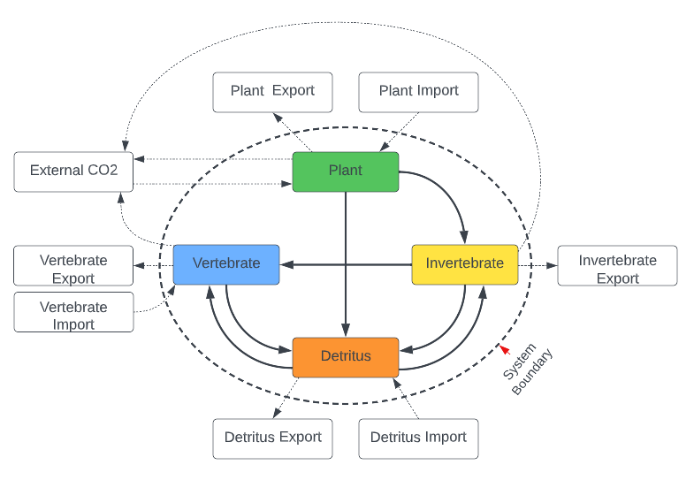
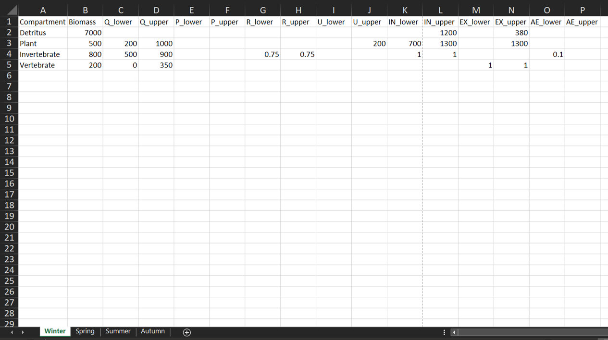
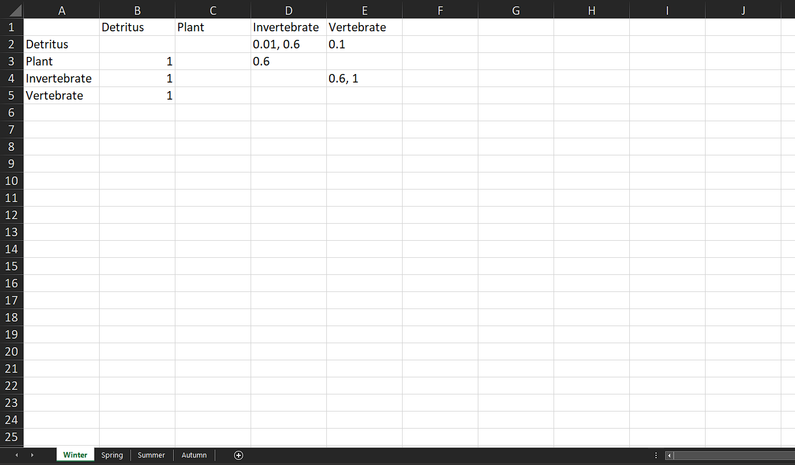

<style>
body {
text-align: justify}
</style>

```{r, include=FALSE}
devtools::load_all(".")
```

```{r, include = FALSE}
knitr::opts_chunk$set(
  collapse = TRUE,
  comment = "#>"
)
```

## Introduction 

A popular method of using linear inverse modelling with Markov Chain Monte Carlo (LIM-MCMC) to calculate multiple plausible networks is with opensource R and R package [LIM](https://cran.r-project.org/web/packages/LIM/index.html) (van Oevelen et al., 2010), and embedded R package [limSolve](https://cran.r-project.org/web/packages/limSolve/index.html) (Soetaert et al., 2009). To use these packages, all input data on network structure (compartments and directed flows) and flow constraints (lower and upper bounds) need to be manually coded into linear equations and declared in particular sections in a LIM-readable text file, the so-called LIM declaration file (van Oevelen et al., 2010). For small networks, the manual construction of a LIM declaration file is straightforward but becomes less manageable in terms of complexity and time as network size increases.

To support researchers in translating network model input data into LIM declaration files, we developed a novel R package named __autoLIMR__. __autoLIMR__ is a programming translator - it reads in network data (in _.xlsx_ format) for one or more networks, and outputs ready to use LIM declaration files compatible with [LIM](https://cran.r-project.org/web/packages/LIM/index.html) and [limSolve](https://cran.r-project.org/web/packages/limSolve/index.html).

The automation saves time and effort, reduces coding error rates, and can be applied to networks of any size. While our example focuses on ecological networks, autoLIM applications are flexible and easily adaptable to a variety of system science disciplines. By removing a barrier in the network construction process, __autoLIMR__ can improve the uptake of LIM techniques in network modelling, and the quality of constructed networks. 

## Installation
The latest version of '__autoLIMR__' can be installed from [GitHub](https://github.com/gemmagerber/autoLIMR). __autoLIMR__ dependencies are automatically installed, including cellranger (>= 1.1.0) (Bryan, 2016), readxl (>= 1.4.1) (Wickham and Bryan, 2022), and utils (>= 4.2.1) (R Core Team, 2022). 

```{r, eval = FALSE}
devtools::install_github("gemmageber/autoLIMR")
library(autoLIMR)
```

## Creating LIM Declaration Files with __autoLIMR__

We describe how to use __autoLIMR__ using a theoretical four-compartment network, describing the network interactions and flow constraints over seasonal time-steps of Winter, Spring, Summer, and Autumn.

```{r, eval = TRUE, echo = FALSE, out.width = "100%", fig.align = 'justified', fig.cap = "_Conceptual four-compartment network with flows describing exchanges between compartments within and across a defined system boundary_"}

```


Prior to using __autoLIMR__, all network data are calculated to a specific model currency or defined as simple proportions of another variable (Fath et al., 2007; Scharler and Borrett, 2021). In our example, the model currency is in units of carbon, i.e., mg C·m^--2^ for compartment biomasses, and mg C·m^--2^·day^--1^ for flows.

__autoLIMR__ requires the user to differentiate and store the required network data in two separate Excel documents: 1) contains all 'Network Input Data', and 2) contains all internal compartment interactions in 'Adjacency Matrix'. In each document, each sheet corresponds to one network, and each sheet should be named uniquely, and matched identically between the two documents. Both documents should be saved in the active R session working directory. We go through each document in detail below.

### Network Input Data Workbook
The first workbook contains network information on: 1) internal compartment names, 2) their respective biomasses, and 3) compartment-specific metabolic constraints. Each sheet will contain all the network information relating to that specific network.

__autoLIMR__ requires the final list of internal compartments to be listed under column 'Compartment', and respective biomasses under the column 'Biomass'. The network information is listed under separate column headings, with each row hosting the information for a particular compartment. The network information describes lower and upper bounds for inputs and outputs of each living compartment if these values are available. If only equalities exist for the particular parameter, the should be entered as both lower and upper values. __autoLIMR__ understands compartment inputs and outputs as Consumption (Q) (or the equivalent gross primary production (GPP) in the case of primary producers), Production (P) (or the equivalent Net Primary Production (NPP) in the case of primary producers), unused material/energy (egestion and mortality combined) (U), and assimilation efficiency (AE) (as a fraction of total consumption). The values can be absolute values, or simple proportions of another variable e.g., `Plant_R = 0.02 * Plant_NPP`. If the metabolic parameter values are not available, the user leaves these blank, and no constraints for Q, P, U, or AE (or primary producer equivalents) are generated by __autoLIMR__.

For all compartments that feature imports (IM) and exports (EX) across the system boundary the user inputs lower and upper inequalities in separate columns. If a compartment receives an import or export, but the inequalities are not known, the user inputs a `1` in the respective column.

```{r, eval = TRUE, echo = FALSE, out.width = "100%", fig.align = 'justified', fig.cap = "_Network input data sheet Winter example, showing pre-calculated data describing the food web model compartments, biomasses, and metabolic constraints entered a named Excel spreadsheet. Column headings describe the metabolic data in the column, and each row corresponding to one compartment. Each named spreadsheet corresponds to a seperate network ('Winter', 'Spring', 'Summer', 'Autumn'), each containing all relevant network-specific information. __autoLIMR__ accepts both character and numeric input from the spreadsheet._"}

```

To view the network input data for all seasons, the example network data provided with __autoLIMR__ can be downloaded from the [autoLIMR Supplemental Information GitHub repository](https://github.com/gemmagerber/autoLIM_Supplemental_Information), or fetched with `demo_net_input()`. The demo network data input is a list of four data tables containing network data input for 'Winter', 'Spring', 'Summer', and 'Autumn' four-compartment networks.

```{r, echo = TRUE}
demo_net_input()
```


### Adjacency Matrix Data Workbook

In the 'Adjacency Matrix Input' workbook, flows between source (row _i_) and recipient (column _j_) are defined by `1`. If the proportions of compartmental inflow from different sources are provided, these can instead be entered as a constraint in the form of _lower value, upper value_. For example, `0.2,0.5` indicates that a specific flow comprises 20 - 50 % of compartment _j_'s total consumptive input. If only the lower proportion is known, it can be entered as _lower value, 1_, e.g., `0.2, 1` indicates that the flow contributes a minimum of 20 % and a maximum of 100% to total consumption. If only the upper diet proportion is known, it can be entered as the constraint _upper value_ or _0, upper value_ (e.g., `0.6` or `0, 0.6` – indicating that the flow contributes a maximum of 60 % to total consumption). R packages LIM and limSolve do not use flow values below or equal to zero (van Oevelen et al., 2010).

```{r, echo = FALSE, out.width = "100%", fig.align = 'center', fig.cap = "_Adjacency matrix data Winter example, describing flows and flow constraints from compartment in row _i_ to compartment in column _j_. Each named spreadsheet corresponds to a seperate network ('Winter', 'Spring', 'Summer', 'Autumn'), each containing all relevant network-specific information. __autoLIMR__ accepts both character and numeric input from the spreadsheet._"}

```

To view the adjacency matrix data for all seasons, the example adjacency matrix data provided with __autoLIMR__ can be downloaded from the [autoLIMR Supplemental Information GitHub repository](https://github.com/gemmagerber/autoLIM_Supplemental_Information), or fetched with `demo_adj_mat()`. The demo adjacency matrix input is a list of four data tables containing adjacency matrices for 'Winter', 'Spring', 'Summer', and 'Autumn' four-compartment networks. Each adjacency matrix describes internal flows of energy/material from compartment in row _i_ to compartment in column _j_.

```{r, echo = TRUE}
demo_adj_mat()
```

### autoGen(): write LIM declaration files into folders in working directory

Once both workbooks have been populated, __autoLIMR__ uses the function `autoGen()` to take the information from both workbooks, and output ready to use LIM declaration file in RStudio script format (_.R_). __autoLIMR__ creates two folders in the working directory: 1) 'autoLIMR Weighted Network LIMfiles' and 2) 'autoLIMR Unweighted Network LIMfiles'.

The exact nature of translation depends on three main `autoGen()` arguments: 1) whether respiration from living compartments to an external CO2 sink is included in the network (LOGICAL, default `respiration = TRUE`), 2) whether each compartment is living or non-living (character vector, default `NLNode = NULL`), and 3) whether each compartment sources its energy from outside the system boundary e.g., primary producers in ecological networks (character vector, default `primary_producer = NULL`).

A non-negotiable `autoGen()` argument is `force`, which is asking the user for permission to write to the working directory. By default, `force = FALSE`. The user will need to provide consent for __autoLIMR__ to write LIMfiles in their respective folders in the working directory by setting `force = TRUE`.

```{r, eval = FALSE}
autoGen(
  net_data_input = "my_network_input_data.xlsx",
  adj_mat_input = "my_network_adj_mat_data.xlsx",
  NLNode = NULL,
  primary_producer = NULL,
  respiration = TRUE,
  author = "Jane Doe",
  force = TRUE
)
```

A handy demo of `autoGen()` is included in this package, using the demo datasets from `demo_net_input()` and `demo_adj_mat()`. Users can simply run the code below, with the `net_data_input = "demo"` and `adj_mat_input = "demo"` to automatically pull the respective demo datasets into `autoGen()` and write the respective folders of LIM declaration files to the working directory. 

```{r, eval = FALSE}
autoGen(
  net_data_input = "demo",
  adj_mat_input = "demo",
  NLNode = "Detritus",
  primary_producer = "Plant",
  respiration = TRUE,
  author = "autoLIMR authors",
  force = TRUE
)
```

An example of the Winter weighted LIM declaration output from __autoLIMR__:

```{r, eval = FALSE}
! Weighted Network
! Network LIM Declaration File
! Composed with autoLIMR
! Author: Gemma Gerber
! Date: 2022-10-28

! Respiration included: Yes
! U included: Yes

! Living compartments: 3
! Non-living compartments: 1
! External compartments: 7
! Boundary flows: 10
! Internal flows: 7

! Abbreviations
! GPP = Gross Primary Production (Primary Producers only)
! Q = Consumption
! NPP = Net Primary Production (Primary Producers only)
! P = Production
! R = respiration
! U = Passive flows to non-living compartments/Unassimilated material
! AE = Assimilation Efficiency
! IM = Import flow
! EX = Export Flow
! NLNode = Non-living compartment

### COMPARTMENTS

Invertebrate = 800.00
Plant = 500.00
Vertebrate = 200.00
DetritusNLNode = 7000.00

### END COMPARTMENTS

### EXTERNALS

CO2
DetritusNLNodeInput
InvertebrateInput
PlantInput
DetritusNLNodeExport
PlantExport
VertebrateExport

### END EXTERNALS

### VARIABLES

! Consumption (Q) / Gross Primary Production (GPP) Variables

Invertebrate_Q = Flowto(Invertebrate) - Invertebrate_IN
Plant_GPP = Flowto(Plant) - Plant_IN
Vertebrate_Q = Flowto(Vertebrate)

! Production (P/NPP) Variables

Invertebrate_P = Flowfrom(Invertebrate) - Invertebrate_R - Invertebrate_U
Plant_NPP = Flowfrom(Plant) - Plant_R - Plant_U - Plant_EX
Vertebrate_P = Flowfrom(Vertebrate) - Vertebrate_R - Vertebrate_U - Vertebrate_EX

! Unused Energy/Material (U) Variables

Invertebrate_U = Flowto(Invertebrate) - Invertebrate_P - Invertebrate_R
Plant_U = Flowto(Plant) - Plant_NPP - Plant_R - Plant_EX
Vertebrate_U = Flowto(Vertebrate) - Vertebrate_P - Vertebrate_R - Vertebrate_EX

! Assimilation Efficiency (AE) Variables

Invertebrate_AE = Invertebrate_P + Invertebrate_R
Vertebrate_AE = Vertebrate_P + Vertebrate_R

### END VARIABLES

### FLOWS

! GPP flows

Plant_GPP: CO2 -> Plant

! Respiration flows

Plant_R: Plant -> CO2
Invertebrate_R: Invertebrate -> CO2
Vertebrate_R: Vertebrate -> CO2

! Import flows

DetritusNLNode_IM: DetritusNLNodeImport -> DetritusNLNode
Invertebrate_IM: InvertebrateImport -> Invertebrate
Plant_IM: PlantImport -> Plant

! Export flows

DetritusNLNode_EX: DetritusNLNode -> DetritusNLNodeExport
Plant_EX: Plant -> PlantExport
Vertebrate_EX: Vertebrate -> VertebrateExport

! Adjacency Matrix flows

DetritusNLNode_Q_Invertebrate: DetritusNLNode -> Invertebrate
DetritusNLNode_Q_Vertebrate: DetritusNLNode -> Vertebrate
Invertebrate_Q_Vertebrate: Invertebrate -> Vertebrate
Invertebrate_U_DetritusNLNode: Invertebrate -> DetritusNLNode
Plant_Q_Invertebrate: Plant -> Invertebrate
Plant_U_DetritusNLNode: Plant -> DetritusNLNode
Vertebrate_U_DetritusNLNode: Vertebrate -> DetritusNLNode

### END FLOWS

### INEQUALITIES

! Network Data Input Inequalities

Plant_GPP > 200.00
Invertebrate_Q > 500.00
Plant_GPP < 1000.00
Invertebrate_Q < 900.00
Vertebrate_Q < 350.00
Invertebrate_R > 0.75
Invertebrate_R < 0.75
Plant_U < 200.00
Plant_IM > 700.00
DetritusNLNode_IM < 1200.00
Plant_IM < 1300.00
DetritusNLNode_EX < 380.00
Plant_EX < 1300.00
Invertebrate_AE > Invertebrate_Q * 0.50
Vertebrate_AE > Vertebrate_Q * 0.20
Invertebrate_AE > Invertebrate_Q * 0.80
Vertebrate_AE > Vertebrate_Q * 0.30

! Adjacency Matrix Inequalities

DetritusNLNode_Q_Invertebrate = Invertebrate_Q * [0.01,0.6]
Plant_Q_Invertebrate < Invertebrate_Q * 0.6
Invertebrate_Q_Vertebrate = Vertebrate_Q * [0.6,1]

### END INEQUALITIES


```


### References
* Bryan, J., 2016. _cellranger: Translate Spreadsheet Cell Ranges to Rows and Columns_. https://doi.org/https://cran.r-project.org/package=cellranger
* Fath, B.D., Scharler, U.M., Ulanowicz, R.E., Hannon, B., 2007. _Ecological network analysis: network construction_. Ecological Modelling. 208, 49–55. https://doi.org/10.1016/J.ECOLMODEL.2007.04.029
* R Core Team, 2022. R: _A language and environment for statistical computing_. https://doi.org/https://www.r-project.org/
* Scharler, U.M., Borrett, S.R., 2021. _Network construction, evaluation and documentation: A guideline_. Environ. Model. Softw. 140, 105020. https://doi.org/https://doi.org/10.1016/j.envsoft.2021.105020
* Soetaert, K., van den Meersche, K., van Oevelen, D., 2009. _limSolve: Solving Linear Inverse Models_. https://doi.org/https://cran.r-project.org/package=limSolve
* van Oevelen, D., van den Meersche, K., Meysman, F.J.R., Soetaert, K., Middelburg, J.J., Vézina, A.F., 2010. _Quantifying food web flows using linear inverse models_. Ecosystems 13, 32–45. https://doi.org/10.1007/s10021-009-9297-6
* Wickham, H., Bryan, J., 2022. _readxl: Read Excel Files_. https://doi.org/https://cran.r-project.org/package=readxl
